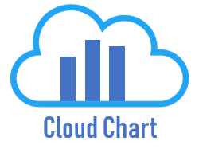
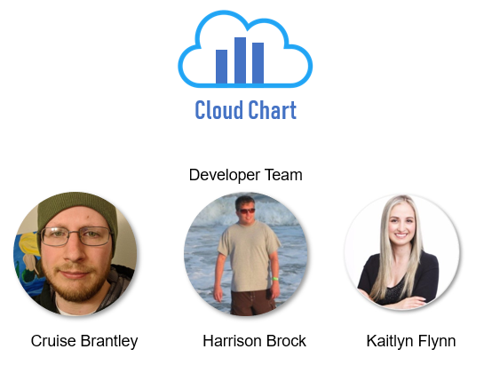

# Cloud Chart

Cloud Chart is our version of Airtable which is a spreadsheet-database hybrid, with the features of a database but applied to a spreadsheet. 



<!-- ## Getting Started

These instructions will get you a copy of the project up and running on your local machine for development and testing purposes. See deployment for notes on how to deploy the project on a live system.

### Prerequisites

What things you need to install the software and how to install them

```
Give examples
```

### Installing

A step by step series of examples that tell you how to get a development env running

Say what the step will be

```
Give the example
```

And repeat

```
until finished
```

End with an example of getting some data out of the system or using it for a little demo

## Running the tests

Explain how to run the automated tests for this system

### Break down into end to end tests

Explain what these tests test and why

```
Give an example
```

### And coding style tests

Explain what these tests test and why

```
Give an example
```

## Deployment

Add additional notes about how to deploy this on a live system -->

## Built With

* [React](https://reactjs.org/) - The web framework used for front end
* [Spring](https://spring.io/projects/spring-framework) - The web framework used for back end
* [Maven](https://maven.apache.org/) - Dependency Management
* [Axios](https://github.com/axios/axios) - Promise based HTTP client for browser and node.js
* [h2](http://www.h2database.com/html/main.html) - Database for development purposes
* [MySQL](https://www.mysql.com/) - Database for production purposes
* [Spring Security Core](https://mvnrepository.com/artifact/org.springframework.security/spring-security-core) - Spring Security & Authentication
* [Spring Security Web](https://mvnrepository.com/artifact/org.springframework.security/spring-security-web) - Spring Security


## Authors

* **Cruise Brantley** - *Developer* - [LinkedIn](https://www.linkedin.com/in/cruisebrantley/)
* **Harrison Brock** - *Developer* - [LinkedIn](https://www.linkedin.com/in/harrisonbrock/)
* **Kaitlyn Flynn** - *Developer* - [LinkedIn](https://www.linkedin.com/in/kaitlynflynn/)




## License

This project is licensed under the MIT License - see the [LICENSE.md](LICENSE.md) file for details

## Acknowledgments

* Inspired by Airtable to create our own version
* We hope to continue building and expanding features
